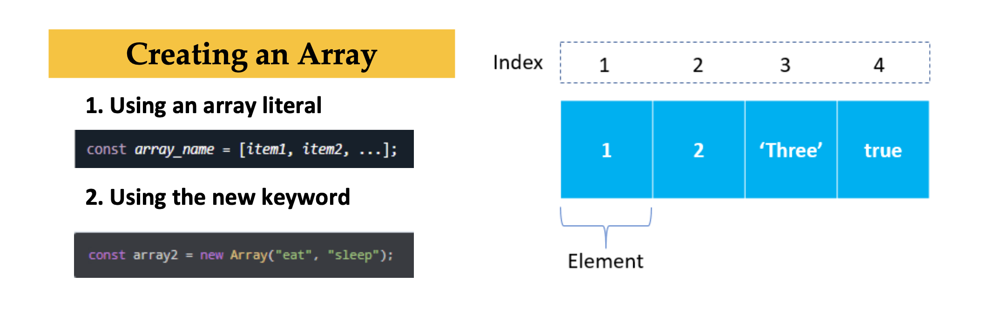
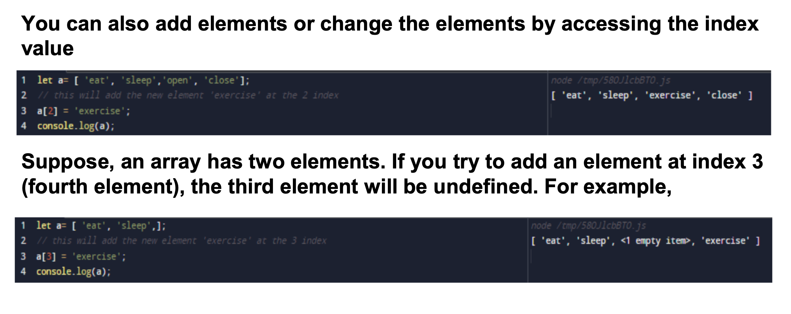

# Array in Java Script

>  An **array** is an object that holds values (of any type) not particularly in named properties/keys, but rather in numerically indexed position In JavaScript, an array is an ordered list of values. Each value is called an element specified by an index. ... First, an array can hold values of mixed types.

 
 

##  Array methods
- **`push()`**  
    >The `push()` method adds the specified elements to the end of an array and returns the new length of the array.
    

- **`unshift()`**  
    >The `unshift()` method adds the specified elements to the beginning of an array and returns the new length of the array.
- **`pop()`**     
    >The `pop()` method removes the last element from an array and returns that element. This method changes the length of the array.
- **`shift()`**  
    >The `shift()` method removes the first element from an array and returns that removed element. This method changes the length of the array.
- **`reverse()`**  
    >The `reverse()` method reverses an array  and returns the reference to the same array, the first array element now becoming the last, and the last array element becoming the first. In other words, elements order in the array will be turned towards the direction opposite to that previously stated.

- **`splice()`**  
    >The `splice()` method changes the contents of an array by removing or replacing existing elements and/or adding new elements

##  JS Array methods Callbacks
- **`map()`**  
    >The `map()` method creates a new array populated with the results of calling a provided function on every element in the calling array.
- **`forEach()`**  
    >The `forEach()` method executes a provided function once for each array element.
- **`find()`**  
    >The `find()` method returns the first element in the provided array that satisfies the provided testing function. If no values satisfy the testing function, undefined is returned.
- **`sort()`**  
    >The `sort()` method sorts the elements of an array  and returns the reference to the same array, now sorted.

 

